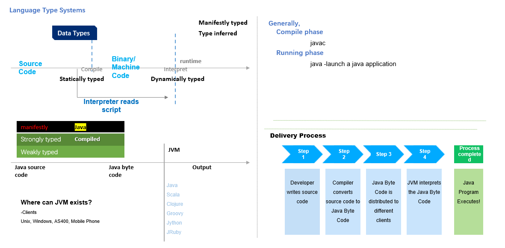

### :alien: 幻读程序员的语言地图:hankey::hankey: 

### :open_file_folder:  
#### Introduction to Language Type System
:earth_asia: ***Data types***  
一图读懂  
*Python is interpreted, with dynamic semantics*  
&nbsp;&nbsp; - *Control flow* & *Data structures*  

:kiss: ***In Java, it has***  
&nbsp;&nbsp; Data types, methods and casting  
&nbsp;&nbsp; Junit and basic testing concepts  
&nbsp;&nbsp; Collections (arraylist, sets)  
&nbsp;&nbsp; Overloading and overriding, polymorphism concepts  
&nbsp;&nbsp; Memory handling, garbage collection  
&nbsp;&nbsp; Threading problems  
&nbsp;&nbsp; Design patterns  

### :open_file_folder:  
Stack and heap: one heap per JVM, one stack per thread  
:round_pushpin: `JVM`，`JRE`[^1]，`JDK`[^2].  
  

[^1]: A software, contains JVM, 执行Java应用程序  
[^2]: 免费Java*软件开发套件（SDK）*  
  
[ref](https://dev.to/nikolab/complete-list-of-github-markdown-emoji-markup-5aia)
